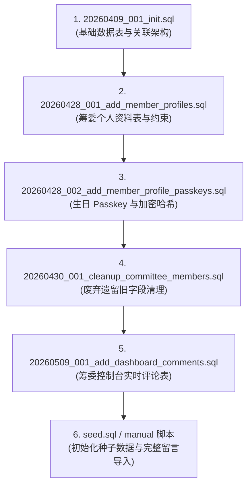

<div align="center">

  

  # 全中华贰拾 · 承廿赴川
  ### QZH20 筹委会门户与纪念回忆空间

  <p align="center">
    <b>专为第二十届全国中学生华文学会生活营（全中华贰拾）筹委会打造的现代化专属平台 —— 汇聚分站与总站回忆画廊、生动吉祥物互动、筹委会部门风采，以及高安全性的专属留言信箱。</b>
  </p>

  <p align="center">
    
    
    
    
    
    
  </p>

  <p align="center">
    <a href="#-项目简介-overview">项目简介</a> •
    <a href="#-核心功能亮点-key-features">功能亮点</a> •
    <a href="#-技术栈与架构-tech-stack">技术架构</a> •
    <a href="#-快速开始-quick-start">快速开始</a> •
    <a href="#-环境变量配置-environment-variables">环境变量</a> •
    <a href="#-数据库迁移指南-database-setup">数据库配置</a> •
    <a href="#-登录与身份认证机制-auth-format">认证机制</a> •
    <a href="#-项目目录结构-directory-tree">目录结构</a> •
    <a href="#-常用-npm-指令-available-scripts">常用指令</a> •
    <a href="#-详细技术文档-documentation">相关文档</a>
  </p>

  <br />

  <table>
    <tr>
      <td align="center" width="33%">
        <br />
        <b>全中华文化精神</b><br />
        <sub>承廿载薪火相传 · 赴江川万里同行</sub>
      </td>
      <td align="center" width="33%">
        <br />
        <b>吉祥物互动空间</b><br />
        <sub>流畅透明通道动画与循环展示</sub>
      </td>
      <td align="center" width="33%">
        <br />
        <b>8大部门精美贴纸</b><br />
        <sub>互动式部门徽章与筹委风采墙</sub>
      </td>
    </tr>
  </table>

</div>

---

## 🌟 项目简介 (Overview)

**全中华贰拾《承廿赴川》纪念与信息平台 (QZH20 Portal)** 是第二十届全国中学生华文学会生活营（全中华贰拾）筹委会的官方专属数字化空间。

项目融合了现代视觉美学（毛玻璃质感、渐变色彩、GSAP 与 Framer Motion 动效）与严密的企业级数据隔离设计。既作为对外展示全中华营会温情回忆的数字殿堂，亦作为筹委成员输入专属 Passkey 即可查看各自私密留言与发表心得的独立空间。

---

## ✨ 核心功能亮点 (Key Features)

- 🦖 **透明通道动态吉祥物**：采用 Canvas Alpha 混合技术与原生视频循环播放，呈现生动的全中华恐龙宝宝互动体验。
- 📸 **三大营区回忆相册**：涵盖 **南马分站**、**北马分站** 与 **总站** 的高清活动相册，支持自动化清单索引与响应式灯箱浏览。
- 🎨 **8大部门互动风采墙**：主席团、行政、节目、课程、总务、美术、联宣、筹募 8 大职能部门专属精美贴纸与 Q 版像素头像卡片。
- 💌 **专属私密留言信箱**：基于服务端权限隔离，每位筹委成员登录后仅可查看发给自己的专属留言，彻底杜绝数据泄露。
- 🛡️ **严格的数据安全与 RLS**：采用 Birthday Passkey 加密校验、加签名 `httpOnly` Session Cookie 传输、防暴力破解速率限制（Rate Limiting）及 Supabase 行级安全策略（Row-Level Security）。
- 💬 **实时留言板与动态评论**：筹委成员可在个人控制台内发表实时心得反馈与交流。
- 🩺 **自动化健康检测与保活机制**：内置 `/api/health` 诊断接口，并配备 GitHub Actions 定时唤醒工作流，防止云端数据库休眠。

---

## 🛠️ 技术栈与架构 (Tech Stack)

| 分层领域 | 选用技术 | 功能描述 |
| :--- | :--- | :--- |
| **全栈框架** | [Next.js 16 (App Router)](https://nextjs.org/) | 服务端渲染（RSC）、Server Actions 与 API 路由 |
| **前端开发** | [React 19](https://react.dev/) + [TypeScript](https://www.typescriptlang.org/) | 严谨的类型推导与现代化响应式组件架构 |
| **样式与视觉** | [Tailwind CSS v4](https://tailwindcss.com/) + CSS 变量 | 毛玻璃质感、微动效与多端自适应布局 |
| **动效引擎** | [GSAP](https://gsap.com/) + [Framer Motion](https://www.framer.com/motion/) | 丝滑入场动效、页面过渡与交互反馈 |
| **云端数据库** | [Supabase](https://supabase.com/) (PostgreSQL) | 托管式 PostgreSQL 关系数据库与 RLS 权限控制 |
| **数据校验** | [Zod](https://zod.dev/) | 环境变量与表单输入的高性能 Schema 校验 |
| **单元测试** | [Vitest](https://vitest.dev/) | 自动化测试套件与覆盖率验证 |
| **云端部署** | [Vercel](https://vercel.com/) | 边缘托管、自动化 CI/CD 与全球 CDN 加速 |

---

## 🚀 快速开始 (Quick Start)

### 环境要求
- Node.js `20.x` 或更高版本
- npm / pnpm / yarn 包管理器

### 1. 克隆项目与安装依赖
```bash
# 克隆仓库
git clone https://github.com/Chee613/qzh20.git
cd qzh20

# 安装依赖
npm install
```

### 2. 配置本地环境变量
复制模版文件 `.env.example` 并重命名为 `.env.local`：
```bash
cp .env.example .env.local
```
根据实际 Supabase 项目填入对应的连接凭证与安全密钥（详见 [环境变量配置](#-环境变量配置-environment-variables)）。

### 3. 生成静态资源索引清单
扫描并生成回忆相册与吉祥物视频的动态资源索引：
```bash
npm run generate:assets
```

### 4. 启动本地开发服务
```bash
npm run dev
```
在浏览器中打开 [http://localhost:3000](http://localhost:3000) 即可开始体验。

---

## 🔐 环境变量配置 (Environment Variables)

| 变量名称 | 生效作用域 | 说明与用途 | 示例值 |
| :--- | :--- | :--- | :--- |
| `NEXT_PUBLIC_SUPABASE_URL` | 公共 / 客户端 | Supabase 项目的 API 端点链接 | `https://xxxx.supabase.co` |
| `NEXT_PUBLIC_SUPABASE_ANON_KEY` | 公共 / 客户端 | Supabase 公开匿名访问密钥 | `eyJhbGciOi...` |
| `SUPABASE_SERVICE_ROLE_KEY` | 仅服务端 | 数据库管理员密钥（绕过 RLS，严禁泄露至前端） | `eyJhbGciOi...` |
| `SESSION_SECRET` | 仅服务端 | 用于签名与加密身份 Cookie 的密钥（至少 32 字符） | `openssl rand -base64 32` |

> [!WARNING]
> 切勿将 `SUPABASE_SERVICE_ROLE_KEY` 或 `SESSION_SECRET` 暴露给前端打包代码，亦不可将 `.env.local` 提交至 Git 仓库。

---

## 🗄️ 数据库迁移指南 (Database Setup)

在 Supabase 控制台的 **SQL Editor** 中按序依次执行以下迁移脚本：



---

## 🔑 登录与身份认证机制 (Auth Format)

本系统采用轻量而严谨的生日暗号（Passkey）认证体系：

- **账号标识 (Login ID)**：`member1` 至 `member46`（共 46 位筹委）
- **密码格式 (Passkey Formula)**：`[MMDD]`（4位数出生月日）+ `[4位专属暗号]`
- **认证范例**：
  - 生日：`3月7日` &rarr; `0307`
  - 专属暗号：`srls`
  - 最终 Passkey：`0307srls`

---

## 📁 项目目录结构 (Directory Tree)

```
qzh20/
├── .github/workflows/          # GitHub Actions 自动化工作流 (数据库保活 Cron)
├── app/                        # Next.js App Router 路由与页面
│   ├── api/                    # 后端 API 接口 (auth 认证, health 健康检测, mascot 媒体, memories 回忆)
│   ├── dashboard/              # 筹委专属受保护控制台与留言板
│   ├── login/                  # 登录认证页面与表单组件
│   ├── globals.css             # 全局 Tailwind 样式与主题 Token
│   ├── layout.tsx              # 根布局与全局元数据配置
│   └── page.tsx                # 营会官方门户主页
├── components/                 # 可复用 UI 视图组件
│   ├── home/                   # 英雄区、回忆相册、留言总览与登录区块
│   ├── dashboard-background-media.tsx # 控制台背景多媒体渲染器
│   ├── logout-button.tsx       # 安全登出按钮
│   └── transparent-mascot-video.tsx   # Canvas 透明视频播放器
├── docs/                       # 项目详细设计文档与技术指南
│   ├── member-message-coverage.md     # 46 位筹委留言数据覆盖统计
│   ├── mvp-plan.md                    # 项目初期架构蓝图与规划
│   ├── pixel-avatar-guide.md          # Q 版像素头像生成指南与提示词规范
│   └── vercel-deployment-checklist.md # 生产环境部署上线核对表
├── lib/                        # 核心工具库与业务逻辑层
│   ├── auth/                   # 会话签名、Passkey 哈希与接口频次限制
│   ├── generated/              # 自动生成的静态资源 Manifest JSON
│   ├── supabase/               # 服务端 Supabase Client 与数据库类型定义
│   ├── asset-manifests.ts      # 强类型静态资源读取器
│   ├── env.ts                  # Zod 环境变量类型验证器
│   └── mascot-videos.ts        # 吉祥物多媒体地址解析
├── public/                     # 静态公共资源
│   ├── comittee/               # 筹委高清原始资源 (member1..46)
│   ├── dashboard-backgrounds/  # 控制台氛围背景视频与图片
│   ├── mascot-videos/          # 优化后的吉祥物动画短片 (.mp4)
│   ├── memories/               # 南马、北马、总站三大营区历史照片集
│   ├── profiles/               # 筹委 Q 版像素头像资产 (member1..46)
│   ├── stickers/               # 8 大职能部门专属徽章贴纸 (.png)
│   ├── 20th-logo.png           # 20周年《承廿赴川》营会徽标
│   ├── main-logo.png           # “全中华”书法标识
│   └── mascot.png              # 官方吉祥物恐龙宝宝原图
├── scripts/                    # 自动化工程脚本
│   └── generate-asset-manifests.mjs # 媒体相册与视频索引生成脚本
├── supabase/                   # 数据库迁移脚本与种子数据
│   ├── manual/                 # 历史手动数据补丁与完整留言导入脚本
│   ├── migrations/             # 按版本号排列的数据库结构迁移脚本
│   └── seed.sql                # 初始测试数据
└── tests/                      # Vitest 自动化单元测试套件
```

---

## 📜 常用 NPM 指令 (Available Scripts)

| 指令 | 作用说明 |
| :--- | :--- |
| `npm run dev` | 自动生成资源索引并启动本地 Next.js 开发服务（端口 3000） |
| `npm run build` | 生成最新资源索引并构建生产环境优化代码包 |
| `npm run start` | 启动已构建完成的生产环境服务 |
| `npm run generate:assets` | 独立执行资源扫描脚本，输出 JSON 静态清单文件 |
| `npm test` | 执行 Vitest 自动化测试套件 |
| `npm run test:watch` | 以交互式 Watch 模式执行单元测试 |
| `npm run lint` | 执行 ESLint 代码规范与类型检查 |

---

## 📚 详细技术文档 (Documentation)

更详细的架构说明与规范文档可在 [`docs/`](docs/) 目录中查阅：
- 📋 [Vercel 部署上线核对表 (Vercel Deployment Checklist)](docs/vercel-deployment-checklist.md)
- 📊 [筹委留言数据覆盖统计 (Member Message Coverage)](docs/member-message-coverage.md)
- 🎨 [Q 版像素头像生成指南 (Pixel Avatar Generation Guide)](docs/pixel-avatar-guide.md)
- 📐 [MVP 初始架构设计文档 (Original MVP Blueprint)](docs/mvp-plan.md)

---

## 🛡️ 版权与致谢 (License & Acknowledgments)

本项目为私有专属项目，由 **第二十届全国中学生华文学会生活营筹委会（全中华贰拾筹委会）** 倾心打造。保留所有权利。

